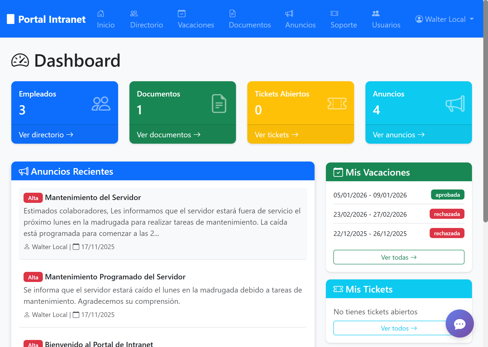
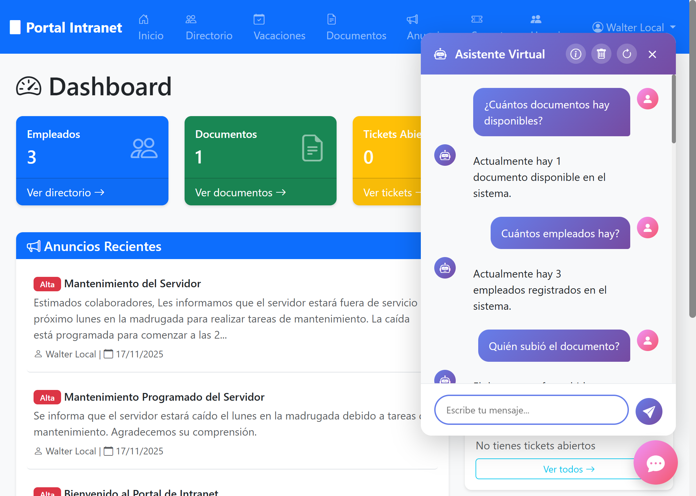
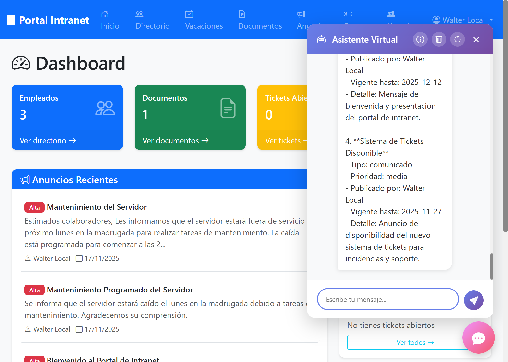
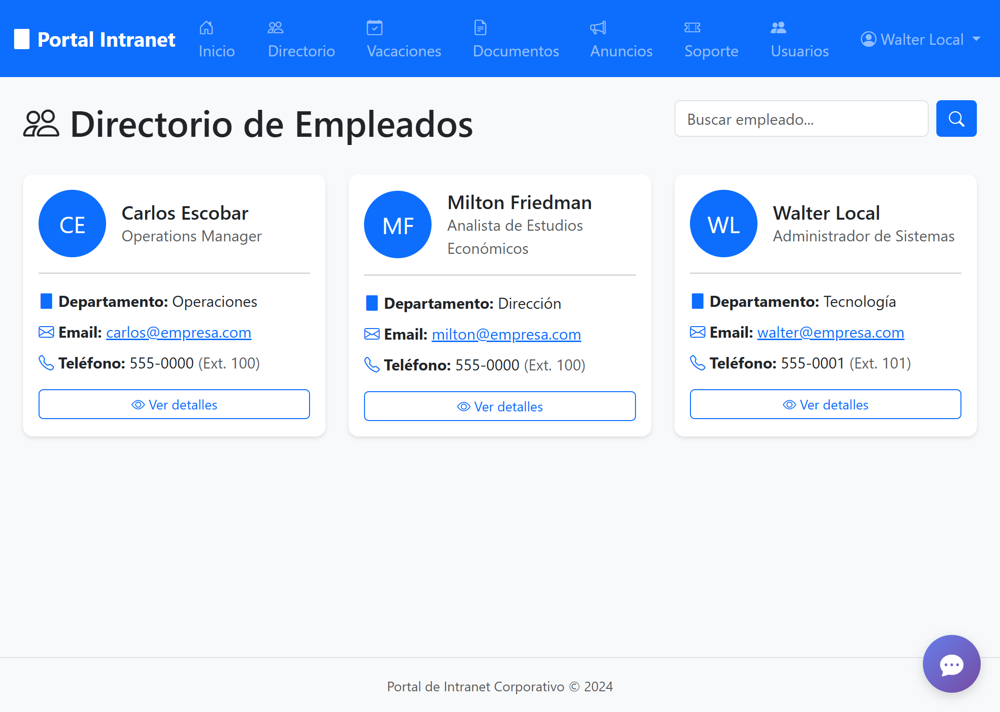
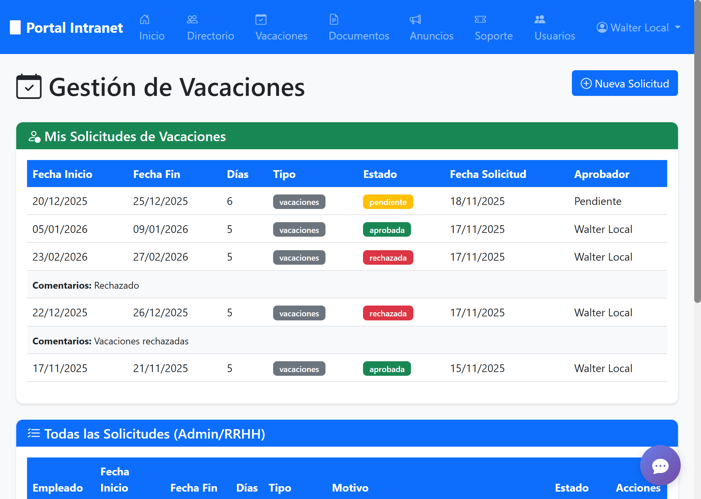
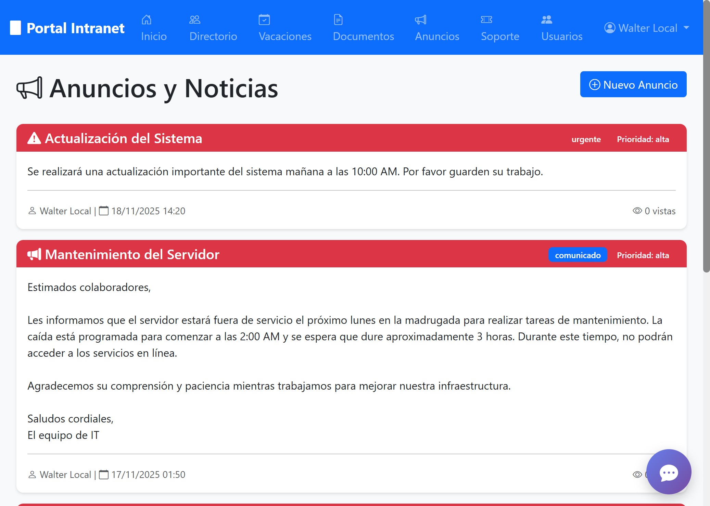
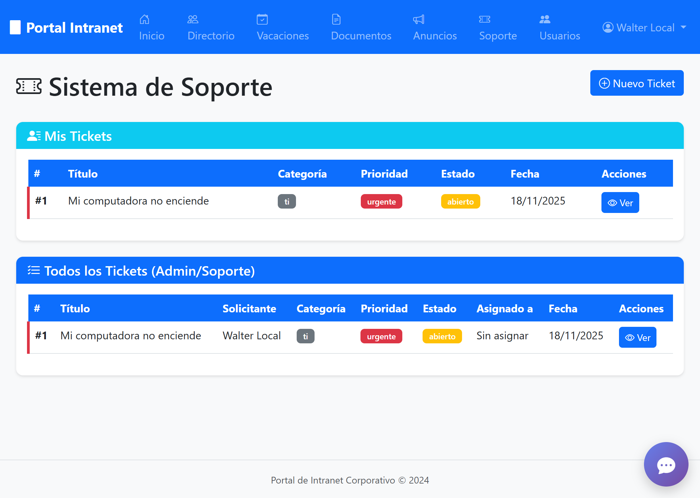

# Portal de Intranet Corporativo con Inteligencia Artificial


Portal de intranet completo desarrollado en Python con Flask y que con bases de datos en MySQL, diseñado para la gestión interna de empresas. Incluye un chatbot con IA integrado que responde dudas, ejecuta acciones como pedir vacaciones, generar tickets, publicar anuncios, etc.

Desarrollado utilizando Claude Code.

El ChatBot es model agnostic, yo lo utilizo con GPT 5.1, con reasoning={ "effort": "medium" }.

## Características Principales

### Módulos del Sistema

| Módulo | Descripción |
|--------|-------------|
| **Autenticación** | Login seguro con roles (admin, empleado, rrhh, soporte) |
| **Directorio de Empleados** | Búsqueda y gestión de información del personal |
| **Gestión de Vacaciones** | Solicitudes, aprobaciones y seguimiento |
| **Documentos Corporativos** | Repositorio con categorías y control de descargas |
| **Anuncios y Noticias** | Comunicados internos con prioridades |
| **Sistema de Tickets** | Soporte interno con seguimiento de estados |
| **Chatbot con IA** | Asistente virtual integrado con OpenAI GPT |

### Características Técnicas

- Contraseñas hasheadas con Werkzeug
- Sesiones seguras
- Validación de permisos por rol
- Protección contra inyección SQL
- Configuración mediante variables de entorno
- Arquitectura modular con Blueprints

## Requisitos

- Python 3.8+
- MySQL 5.7+
- pip (gestor de paquetes de Python)

## Instalación

### 1. Clonar el repositorio

```bash
git clone https://github.com/tu-usuario/intranet.git
cd intranet
```

### 2. Crear y activar entorno virtual

```bash
python -m venv venv

# Windows
venv\Scripts\activate

# Linux/Mac
source venv/bin/activate
```

### 3. Instalar dependencias

```bash
pip install -r requirements.txt
```

### 4. Configurar variables de entorno

Copia el archivo de ejemplo y configura tus valores:

```bash
cp .env.example .env
```

Edita `.env` con tu configuración:

```env
# Base de datos
DB_HOST=localhost
DB_USER=tu_usuario
DB_PASSWORD=tu_password
DB_NAME=intranet_db

# Usuario administrador inicial
ADMIN_USERNAME=admin
ADMIN_PASSWORD=tu_password_seguro
ADMIN_EMAIL=admin@tuempresa.com

# API de OpenAI (para el chatbot)
LLM_API_KEY=tu_api_key
```

### 5. Crear la base de datos

```sql
CREATE DATABASE intranet_db CHARACTER SET utf8mb4 COLLATE utf8mb4_unicode_ci;
```

### 6. Inicializar la base de datos

```bash
python init_db.py
```

Este script crea todas las tablas y el usuario administrador inicial.

### 7. (Opcional) Configurar el chatbot

Si deseas usar el chatbot con IA, ejecuta:

```bash
python create_chatbot_tables.py
```

### 8. Ejecutar la aplicación

```bash
python app.py
```

La aplicación estará disponible en: `http://127.0.0.1:5000`

## Estructura del Proyecto

```
intranet/
├── app.py                  # Aplicación principal Flask
├── config.py               # Configuración
├── database.py             # Conexión a base de datos
├── models.py               # Modelos de datos
├── requirements.txt        # Dependencias Python
├── schema.sql              # Esquema de base de datos
├── chatbot_schema.sql      # Esquema del chatbot
├── .env.example            # Plantilla de configuración
├── modules/                # Módulos de la aplicación
│   ├── auth/               # Autenticación
│   ├── employees/          # Directorio de empleados
│   ├── vacations/          # Gestión de vacaciones
│   ├── documents/          # Documentos corporativos
│   ├── announcements/      # Anuncios y noticias
│   ├── tickets/            # Sistema de tickets
│   └── chatbot/            # Chatbot con IA
├── templates/              # Plantillas HTML (Jinja2)
└── static/                 # Archivos estáticos
    ├── css/
    ├── js/
    └── uploads/
```

## Roles y Permisos

| Rol | Permisos |
|-----|----------|
| **admin** | Acceso completo a todos los módulos |
| **rrhh** | Gestión de vacaciones y empleados |
| **soporte** | Gestión de tickets |
| **empleado** | Acceso básico de lectura y solicitudes |

## Capturas de Pantalla

### Dashboard Principal


### Chatbot con IA - Consultas


### Chatbot - Crear Vacaciones


### Chatbot - Consultar Anuncios


### Directorio de Empleados


### Gestión de Vacaciones


### Anuncios y Noticias


### Sistema de Tickets


## Configuración del Chatbot

El chatbot utiliza la API de OpenAI. Puedes configurar:

- `LLM_API_KEY`: Tu API key de OpenAI
- `LLM_MODEL`: Modelo a usar (default: gpt-4o-mini)
- `LLM_MAX_TOKENS`: Máximo de tokens por respuesta
- `LLM_TEMPERATURE`: Creatividad del modelo (0.0-1.0)

## Contribuir

1. Fork el proyecto
2. Crea una rama para tu feature (`git checkout -b feature/nueva-funcionalidad`)
3. Commit tus cambios (`git commit -m 'Agregar nueva funcionalidad'`)
4. Push a la rama (`git push origin feature/nueva-funcionalidad`)
5. Abre un Pull Request

## Licencia

Este proyecto está bajo la Licencia MIT. Ver el archivo `LICENSE` para más detalles.

## Soporte

Para reportar bugs o solicitar features, por favor abre un [issue](https://github.com/tu-usuario/intranet/issues).
